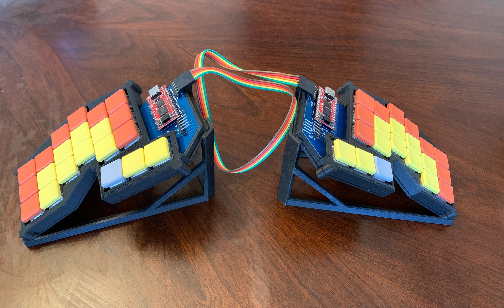
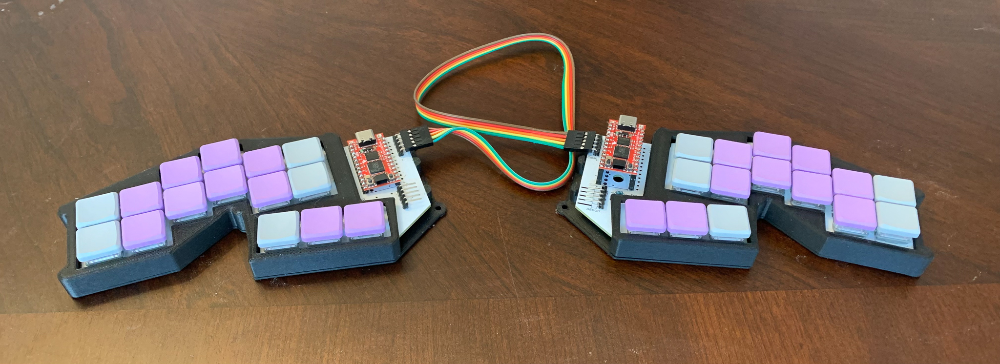

# David Brown (d3zd3z) keyboard designs

This repo captures the design files associated with my custom
keyboards.

These keyboards are primarily focused on Steno input, mainly using
[Plover](https://www.openstenoproject.org/plover/). In the spirit of
open steno, I have made these designs open. Anyone is free to make
designs based on these keyboards, for non-commercial purposes.  I am
releasing the designs under the [CC BY-NC
3.0](https://creativecommons.org/licenses/by-nc/3.0/) license.
Specifically, this means if you wish to sell a product based on the
design, you should talk to me.

## The "proto3"

This is basically the same design as the proto2, but with a third row.
The qmk supports an easier qwerty mode, but still with a modified
homerow modifier support (I use the lower row as it has slightly fewer
rollover conflicts).

The BOM is the same as the proto2, but it will need 42 diodes.

## The "proto2"

For lack of a better name, this first design is called the "proto2".

There was an earlier prototype, that was handwired, and rather
fragile.  This is the first version I would consider to be a usable
keyboard.  In the above pictures, the left half has the MCU (Pro Micro
RP2040) soldered directly to a header, soldered to the PCB, and the
right one uses a socket.

To build this, in addition to the PCBs, you will need

- 2 [Pro Micro RP2040](https://www.sparkfun.com/products/18288)
  boards.  At the time of my build, these are running about $11, and
  seem readily available.
- 30 Kailh Choc switches.  I sourced mine from
  [Mkultra](https://mkultra.click/choc-switches).  I recommend the
  "pink" version, which has 20gf springs, and I find work well.
- 30 keycaps for these switches.  I used the [MBK Factory
  Colors](https://mkultra.click/mbk-factory-colors/) keycaps, which
  allows me to make the "primary" keys stand out a little, and just
  looks rather nice.
- 30 general purpose SOD123 diodes.  I got
  [BAV19W](https://www.digikey.com/en/products/detail/smc-diode-solutions/BAV19W/5993796),
  although almost any diode will work for this.
- 2 or 4 5-pin right angle headers.  Two are needed for the
  communication between the boards.  The others are interested if you
  want to use SWD, since the RP2040 Pro Micro inconveniently puts
  these connectors on the underside of the board.

The PCB is reversable.  The RP2040 board should be mounted in the
labeled holes, which is always the left set when viewed from the top.
The diodes are intended to be soldered to the bottom side of the
board.

I have also a case design that can be 3d printed.  The models are for
the right side. Use your slicing software to mirror about the X axis
to print the pieces for the other side.

The firmware I am using for this keyboard is in my fork of
[QMK](https://github.com/tangybbq/qmk_firmware/tree/proto2).
